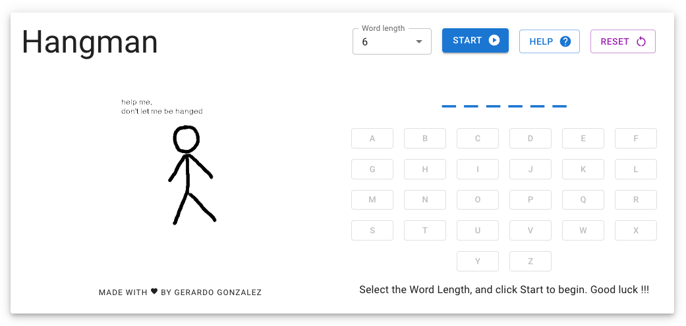

# Hangman Game

Hangman is a guessing game. The Computer will choose a random word and you tries to guess it by suggesting letters within a certain number of guesses.
You can select the Word Length, and will have up to 11 wrong responses.

## Documentation

Hangman is a classic word game in which you must guess the secret word one letter at a time.
### Rules:
- Guess one letter at a time to reveal the secret word.
- Each incorrect guess adds another part to the hangman. You only get 11 incorrect guesses.
- Too many incorrect guesses result in loss of the game.

### How to Play
 - Select the length of the words you want to guess.
 - Click "Start", and click the letter on the screen to start guessing.
 - To stop and select a different word length click "Reset".
 - To show the Rules and How to Play click the "Help" button.

## Installation/Usage

Star by cloning the repo with

```bash
  git clone https://github.com/B1gG/hangman.git
```
Install my-project with npm

```bash
  cd hangman
  npm install
  npm start
```

A new tab will be open in your browser.
Good luck !!!
    
## Acknowledgements

 - [MaterialUI](https://mui.com/)
 - [Rapidapi - Random Words](https://rapidapi.com/sheharyar566/api/random-words5/)
 - [readme.so](https://readme.so/)
 - [HyperionDev - WebDev Bootcamp](https://www.hyperiondev.com/)

This project is for Taks 52 - Hangman Game, using React, JSX and JavaScript.
## Authors / Maintainer

- [@b1gg](https://github.com/B1gG/)
